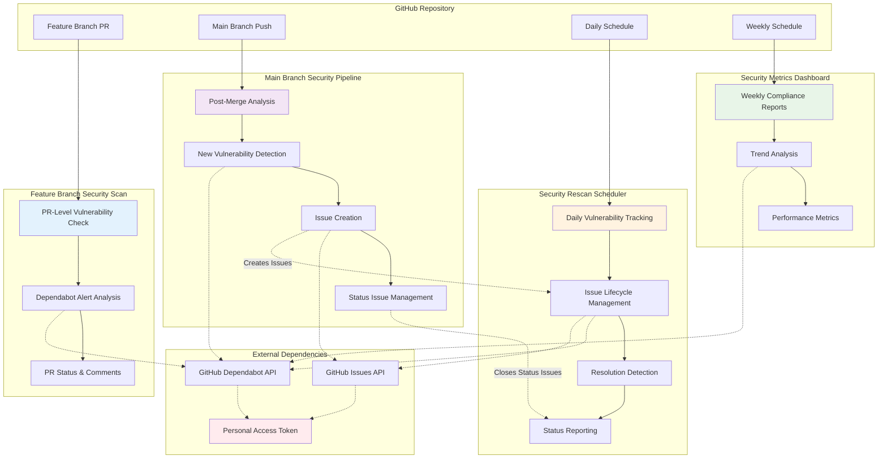
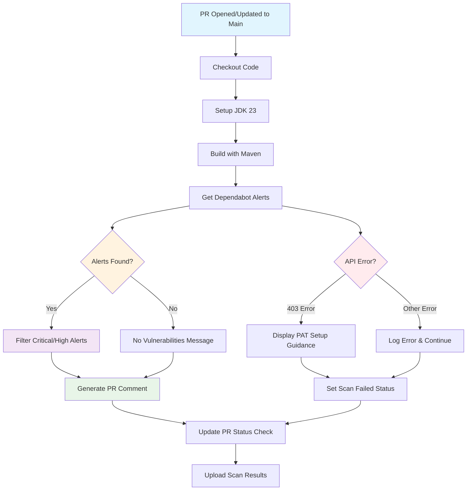
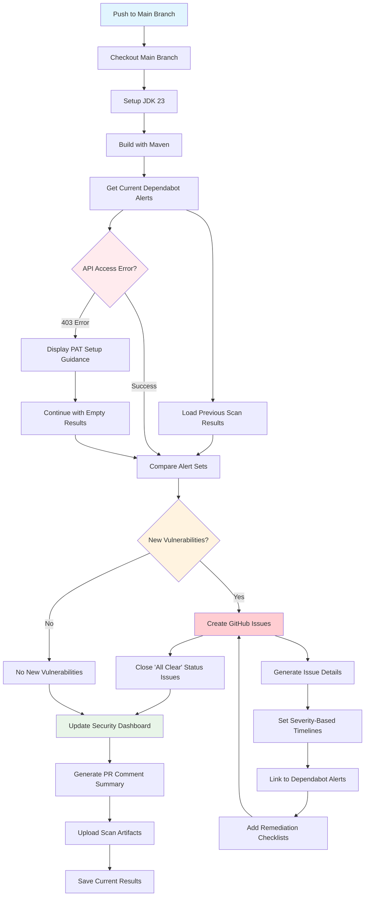
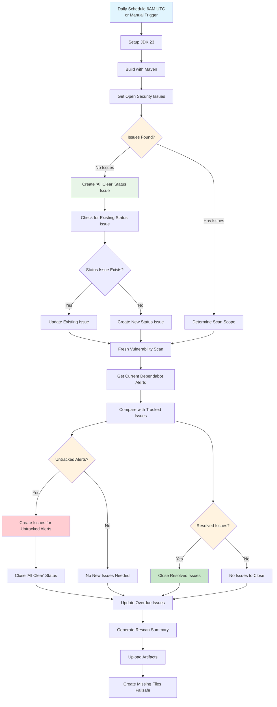
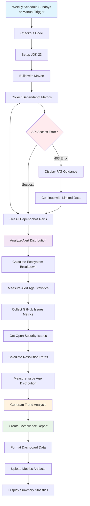
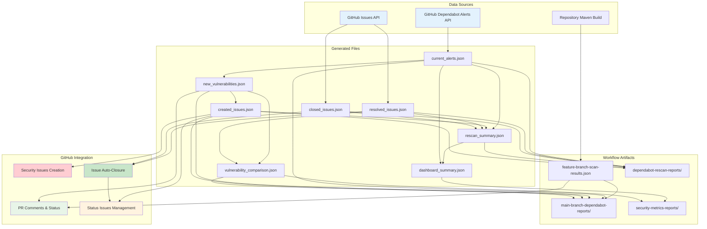

# 🏗️ WebGoat Security Pipeline Workflow Designs

**Document Version**: 1.0  
**Last Updated**: January 2025  
**Purpose**: Complete workflow designs for automated security vulnerability management using GitHub Dependabot

---

## 📋 Table of Contents

1. [Overview](#overview)
2. [Pipeline Architecture](#pipeline-architecture)
3. [Individual Workflow Designs](#individual-workflow-designs)
   - [Feature Branch Security Scan](#1-feature-branch-security-scan)
   - [Main Branch Security Pipeline](#2-main-branch-security-pipeline)
   - [Security Rescan Scheduler](#3-security-rescan-scheduler)
   - [Security Metrics Dashboard](#4-security-metrics-dashboard)
4. [Data Flow & Integration](#data-flow--integration)
5. [Key Design Principles](#key-design-principles)
6. [Authentication & Permissions](#authentication--permissions)
7. [Error Handling & Reliability](#error-handling--reliability)
8. [Artifacts & Reporting](#artifacts--reporting)

---

## 🎯 Overview

The WebGoat Security Pipeline consists of four interconnected GitHub Actions workflows that provide comprehensive automated security vulnerability management using GitHub's native Dependabot alerts system.

### **Core Objectives**
- ✅ **Automated Detection**: Identify vulnerabilities before and after merge
- 🎫 **Issue Tracking**: Create and manage GitHub issues for all vulnerabilities  
- 🔄 **Lifecycle Management**: Track vulnerabilities from detection to resolution
- 📊 **Compliance Reporting**: Generate metrics and trend analysis
- 🛡️ **Status Visibility**: Maintain clear security posture indicators

### **Technology Stack**
- **Platform**: GitHub Actions  
- **Language**: Java 23 with Maven build
- **APIs**: GitHub Dependabot Alerts API, GitHub Issues API
- **Authentication**: Personal Access Token (PAT) with fallback to default token
- **Artifacts**: JSON data files with 60-day retention

---

## 🏛️ Pipeline Architecture



---

## 🔧 Individual Workflow Designs

### **1. 🔍 Feature Branch Security Scan**

**File**: `feature-branch-security-scan.yml`  
**Trigger**: Pull requests opened/updated against main branch  
**Purpose**: Pre-merge vulnerability detection and PR feedback

#### **Workflow Diagram**


#### **Key Features**
- ✅ **Early Detection**: Scans current Dependabot alerts before merge
- 📝 **PR Integration**: Updates PR with detailed security status
- 🚦 **Status Checks**: Provides pass/fail status for merge protection
- 🎯 **Severity Filtering**: Highlights critical and high severity issues
- 🔧 **Error Recovery**: Graceful handling of API access issues

#### **Workflow Steps**
1. **Environment Setup**: JDK 23 + Maven build
2. **Alert Retrieval**: Fetch current Dependabot alerts via API
3. **Filtering**: Focus on critical/high severity vulnerabilities
4. **PR Feedback**: Generate detailed comments with vulnerability info
5. **Status Update**: Set PR status check (success/failure)
6. **Artifact Upload**: Save scan results for debugging

#### **Sample PR Comment**
```markdown
## 🔍 Security Scan Results

**Status**: ⚠️ **VULNERABILITIES FOUND**
**Critical**: 1 | **High**: 2 | **Medium**: 0

### Critical Issues
- CVE-2024-1234 in spring-boot-starter (Severity: 9.8)
  - [View Alert](https://github.com/owner/repo/security/dependabot/123)

### Recommendations
- Review and merge Dependabot security updates before this PR
- Consider security implications of new dependencies
```

---

### **2. 🚀 Main Branch Security Pipeline**

**File**: `main-branch-security-pipeline.yml`  
**Trigger**: Pushes to main branch  
**Purpose**: Post-merge vulnerability analysis and issue creation

#### **Workflow Diagram**


#### **Key Features**
- 📊 **Comparison Analysis**: Detects new vulnerabilities vs. previous scans
- 🎫 **Smart Issue Creation**: Creates detailed GitHub issues with metadata
- 🎯 **Status Management**: Manages "All Clear" status issues
- ⏰ **Severity-Based Timelines**: Auto-calculates resolution deadlines
- 📈 **Dashboard Integration**: Updates security status summaries

#### **Issue Creation Logic**
```javascript
// Severity-based resolution timelines
const targetDays = {
  'critical': 7,   // 1 week
  'high': 14,      // 2 weeks  
  'medium': 30,    // 1 month
  'low': 30        // 1 month
}
```

#### **Created Issue Structure**
```markdown
## Security Vulnerability Alert

**CVE ID**: `CVE-2024-1234`
**Package**: `spring-boot-starter`
**Severity**: **CRITICAL**
**CVSS Score**: 9.8

### Remediation Plan
- [ ] Review Dependabot alert #123
- [ ] Accept Dependabot PR if available
- [ ] Test application functionality
- [ ] Deploy security patch
- [ ] Verify fix resolves alert

### Timeline
- **Target Resolution**: 1/27/2025
- **Days to Resolve**: 7 days

🔗 **[View Dependabot Alert](link)**
```

---

### **3. 🔄 Security Rescan Scheduler**

**File**: `security-rescan-scheduler.yml`  
**Trigger**: Daily at 6:00 AM UTC + manual/workflow_call  
**Purpose**: Continuous vulnerability lifecycle management

#### **Workflow Diagram**


#### **Key Features**
- 🛡️ **Status Issue Management**: Creates/updates "All Clear" status when no vulnerabilities exist
- 🔍 **Gap Detection**: Creates issues for Dependabot alerts without tracking issues
- ✅ **Auto-Resolution**: Closes issues when vulnerabilities are patched
- ⏰ **Overdue Escalation**: Flags issues >30 days old with escalation labels
- 📊 **Daily Reporting**: Comprehensive scan summaries and metrics

#### **All Clear Status Issue**
```markdown
## 🛡️ Security Status Report

**Status**: ✅ **ALL CLEAR**
**Scan Date**: 1/27/2025, 6:00:00 AM
**Last Scan**: 2025-01-27T06:00:00.000Z

### Summary
- **Open Security Issues**: 0
- **Repository Status**: No active security vulnerabilities tracked

### What This Means
✅ No open Dependabot security alerts requiring attention
✅ All previously identified vulnerabilities have been resolved
✅ Security pipeline is actively monitoring for new issues

### Monitoring
- **Dependabot**: Continuously monitoring for new vulnerabilities
- **Scheduled Scans**: Daily automated security reviews
```

#### **Overdue Issue Management**
- Issues >30 days: Add `overdue`, `escalated` labels
- Add urgency comments with escalation notifications
- Update issue priority and assignees

---

### **4. 📊 Security Metrics Dashboard**

**File**: `security-metrics-dashboard.yml`  
**Trigger**: Weekly on Sundays + manual trigger  
**Purpose**: Compliance reporting and security trend analysis

#### **Workflow Diagram**


#### **Key Features**
- 📈 **Trend Analysis**: Historical vulnerability and resolution patterns
- 🎯 **Ecosystem Breakdown**: Vulnerability distribution by package manager
- ⏱️ **Performance Metrics**: Average resolution times and aging analysis
- 📋 **Compliance Reports**: Weekly security posture summaries
- 🔍 **Alert Age Analysis**: Track how long vulnerabilities remain open

#### **Sample Metrics Output**
```json
{
  "scan_date": "2025-01-27T06:00:00.000Z",
  "dependabot_metrics": {
    "total_alerts": 5,
    "severity_breakdown": {
      "critical": 1,
      "high": 2,
      "medium": 2,
      "low": 0
    },
    "ecosystem_breakdown": {
      "maven": 3,
      "npm": 2
    },
    "alert_age_stats": {
      "average_days": 15,
      "oldest_alert_days": 45
    }
  },
  "github_issues_metrics": {
    "open_issues": 3,
    "resolved_this_week": 2,
    "average_resolution_time_days": 12
  }
}
```

---

## 🔄 Data Flow & Integration

### **Inter-Pipeline Communication**


### **Pipeline Interactions**

1. **Feature → Main**: PR scan results inform post-merge analysis
2. **Main → Rescan**: New issues created are tracked by daily scheduler  
3. **Rescan → Metrics**: Resolution data feeds into weekly reporting
4. **Status Coordination**: All pipelines coordinate on "All Clear" status management

### **Issue Lifecycle Flow**
```
Dependabot Alert → Main Branch Creates Issue → Rescan Tracks Daily → Auto-Closes When Resolved → Metrics Reports Trends
```

---

## 🎯 Key Design Principles

### **🔄 Automation-First**
- **Minimal Manual Intervention**: Fully automated vulnerability lifecycle
- **Self-Healing**: Automatic error recovery and retry mechanisms  
- **Smart Deduplication**: Prevents duplicate issues and status conflicts

### **📊 Comprehensive Tracking**
- **Full Lifecycle Coverage**: From detection to resolution to reporting
- **Rich Metadata**: Detailed context, timelines, and remediation guidance
- **Audit Trails**: Complete history of all actions and decisions

### **🛡️ Reliability & Robustness**
- **Graceful Degradation**: Continues operation even with API failures
- **Multiple Authentication**: PAT with fallback to default tokens
- **Error Recovery**: Comprehensive error handling and logging

### **🎨 Developer Experience**
- **Clear Communication**: Rich PR comments and issue descriptions
- **Actionable Guidance**: Step-by-step remediation checklists
- **Status Visibility**: Always-current security posture indicators

---

## 🔐 Authentication & Permissions

### **Required Permissions**
```yaml
permissions:
  contents: read          # Repository code access
  issues: write          # Create/update/close issues  
  pull-requests: write   # PR comments and status
  security-events: write # Dependabot alerts access
```

### **Authentication Methods**

#### **Personal Access Token (Recommended)**
```yaml
github-token: ${{ secrets.DEPENDABOT_PAT || github.token }}
```

**PAT Setup Requirements:**
- **Scopes**: `repo`, `security_events`, `read:org`
- **Repository Access**: All repositories or specific repo access
- **Expiration**: Set appropriate expiration and renewal process

#### **Default Token (Fallback)**
- Limited permissions may cause 403 errors
- Use PAT for reliable access to security APIs

### **403 Error Handling**
```javascript
if (error.status === 403) {
  console.error('❌ Dependabot alerts are not accessible. Solutions:');
  console.error('  🔑 RECOMMENDED: Set up a Personal Access Token (DEPENDABOT_PAT secret)');
  console.error('  📋 Alternative: Ensure repository has Dependabot alerts enabled');
  console.error('  🔒 For private repos: Enable GitHub Advanced Security');
}
```

---

## 🛡️ Error Handling & Reliability

### **API Failure Scenarios**

| **Error Type** | **Response** | **Fallback** |
|----------------|--------------|--------------|
| 403 Forbidden | Display PAT setup guidance | Continue with empty results |
| 404 Not Found | Log warning, continue | Skip affected operations |
| 500 Server Error | Retry with exponential backoff | Fail gracefully |
| Network Timeout | Retry up to 3 times | Mark as failed |

### **File System Reliability**
```python
# Failsafe file creation for artifact uploads
files_to_create = {
    './current_dependabot_alerts.json': [],
    './rescan_summary.json': {
        'scan_date': '',
        'scan_type': 'skipped',
        'total_vulnerabilities': 0
    }
}

for file_path, default_content in files_to_create.items():
    if not os.path.exists(file_path):
        with open(file_path, 'w') as f:
            json.dump(default_content, f, indent=2)
```

### **Cross-Platform Compatibility**
- **Shell Commands**: Replaced with Python scripts for Windows/Linux/Mac compatibility
- **Path Handling**: Relative paths for consistent behavior
- **JSON Processing**: Native Python JSON handling vs. shell string manipulation

---

## 📦 Artifacts & Reporting

### **Artifact Organization**
```
WebGoat/
├── feature-branch-scan-results-{run_number}/
│   └── scan_results.json
├── main-branch-dependabot-reports-{run_number}/  
│   ├── current_alerts.json
│   ├── new_vulnerabilities.json
│   ├── created_issues.json
│   └── vulnerability_comparison.json
├── dependabot-rescan-reports-{run_number}/
│   ├── current_dependabot_alerts.json
│   ├── rescan_summary.json
│   ├── resolved_issues.json
│   ├── closed_issues.json
│   └── open_security_issues.json
└── security-metrics-reports-{run_number}/
    ├── dashboard_summary.json
    └── trend_analysis.json
```

### **Retention Policy**
- **Retention Period**: 60 days
- **Storage Location**: GitHub Actions artifacts
- **Access**: Via GitHub UI or REST API
- **Cleanup**: Automatic after retention period

### **Report Formats**

#### **Daily Summary**
```
=== Dependabot Security Rescan Summary ===
Scan Type: scheduled
Current Dependabot Alerts: 5
Issues Resolved: 2
Issues Closed: 2  
New Issues Created: 1
Overdue Issues Updated: 1
Scan Status: ✅ COMPLETED
```

#### **Weekly Metrics**
```json
{
  "period": "2025-01-20 to 2025-01-27",
  "summary": {
    "new_vulnerabilities": 3,
    "resolved_vulnerabilities": 5,
    "net_change": -2,
    "current_open_alerts": 8
  },
  "performance": {
    "average_resolution_time_days": 12,
    "fastest_resolution_days": 2,
    "slowest_resolution_days": 45
  }
}
```

---

## 🚀 Getting Started

### **Setup Checklist**
- [ ] Enable Dependabot alerts in repository settings
- [ ] Create Personal Access Token with required scopes
- [ ] Add `DEPENDABOT_PAT` secret to repository
- [ ] Configure branch protection rules (optional)
- [ ] Review and customize workflow schedules
- [ ] Test with a sample PR to verify functionality

### **Monitoring & Maintenance**
- **Daily**: Review rescan summaries and resolve critical issues
- **Weekly**: Review metrics dashboard and trend analysis  
- **Monthly**: Review PAT expiration and renew if needed
- **Quarterly**: Audit workflow performance and optimization opportunities

---

## 📞 Support & Troubleshooting

### **Common Issues**

| **Issue** | **Cause** | **Solution** |
|-----------|-----------|--------------|
| 403 API Errors | Missing/expired PAT | Set up DEPENDABOT_PAT secret |
| No alerts found | Dependabot not enabled | Enable Dependabot in repo settings |
| Workflow failures | Java version mismatch | Ensure JDK 23 compatibility |
| Missing artifacts | File creation failures | Check failsafe file creation logic |

### **Debug Information**
- **Workflow Logs**: Available in GitHub Actions tab
- **Artifact Downloads**: Available for 60 days post-run
- **API Rate Limits**: Monitor usage in workflow logs
- **Error Details**: Check enhanced error logging for 403/API issues

---

**Document End** - *For questions or issues, contact the Application Security Team* 